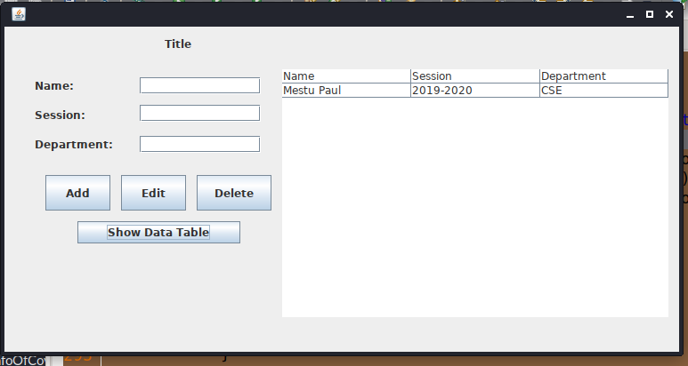

<h3>It is simple java project</h3>

<b>Language</b> 
<ul>
    <li>Java</li>
</ul>
<b>Tools</b> 
<ul>
    <li>Eclips IDE </li>
    <li>jdk</li>
    <li>Java swing</li>
</ul>
<b>Data Store</b> 
<ul>
    <li>Text file</li>
</ul>
<b>Features</b> 
<ul>
    <li>One can add Name, Department, Session</li>
    <li>One can delete data <b>Using Password</b></li>
    <li>One can edit data <b>Using Password</b></li>
</ul>